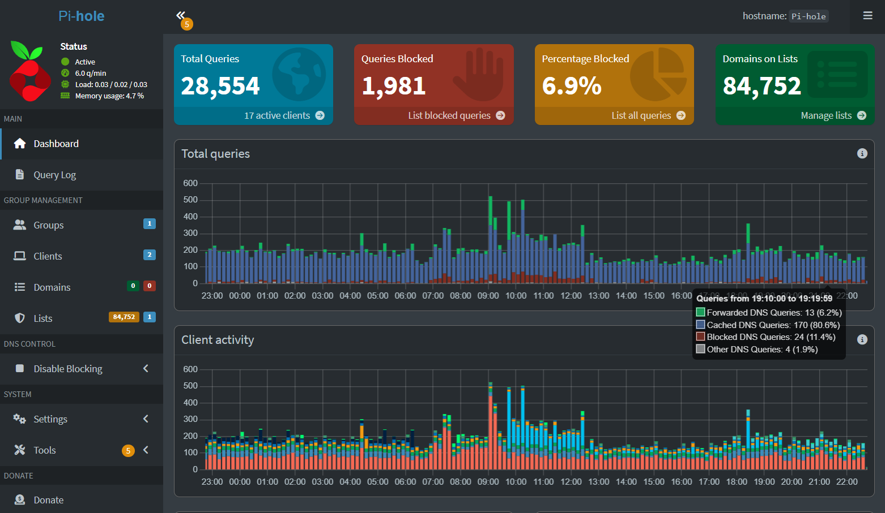

# Pi-Hole-Lab
Pi‑hole Network‑Wide Ad Blocking on Proxmox
# Pi‑hole Network‑Wide Ad Blocking on Proxmox

## Objective
Deploy Pi‑hole as a dedicated DNS sinkhole in a Proxmox LXC container, integrate it with Existing Archer router for DHCP to block ads and trackers for every device on the network, and harden DNS to prevent bypass.

## Technologies Used
- Proxmox VE 8.x (LXC container, Debian 12)
- Pi‑hole 5.x
- Archer AX21 – DHCP server
- `pihole` CLI, `curl`, `apt`, `bash`

## Implementation Highlights
- Created a Debian LXC container with 512MB RAM, 1 core, 4GB disk
- Assigned static IP `192.168.10.10/24` 
- Installed Pi‑hole via the official one‑step installer (`curl -sSL https://install.pi-hole.net | bash`)
- Selected Cloudflare (DNSSEC) as upstream DNS provider
- Enabled the web admin interface (`lighttpd`) and set privacy level to 0 (show everything)
- Configured Archer router to hand out Pi‑hole’s IP as the sole DNS server
- Created firewall rule on Archer AX21 to allow DNS from all devices to Pi‑hole  and blocked all outbound DNS not destined for Pi‑hole (forced DNS redirection)

## Troubleshooting Highlights
- **Container had no internet after creation** – resolved by adding temporary DNS (`8.8.8.8`) and verifying default gateway via `ip route`
- **Pi‑hole blocked everything on first deployment** – identified overly aggressive blocklists; set privacy level to 0 for visibility and disabled blocking temporarily to isolate cause
- **Wireless clients couldn't resolve names** – added explicit firewall rule router allowing DNS to Pi‑hole’s IP 

## Screenshots

## Future Improvements
- Add Pi‑hole blocklist groups and schedule automatic gravity updates
- Integrate Pi‑hole with Zabbix/Grafana for monitoring
- Use Pi‑hole’s API to script temporary disable for testing

## Author
Marc Mentor – mentormarc32@gmail.com 
